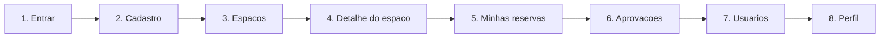
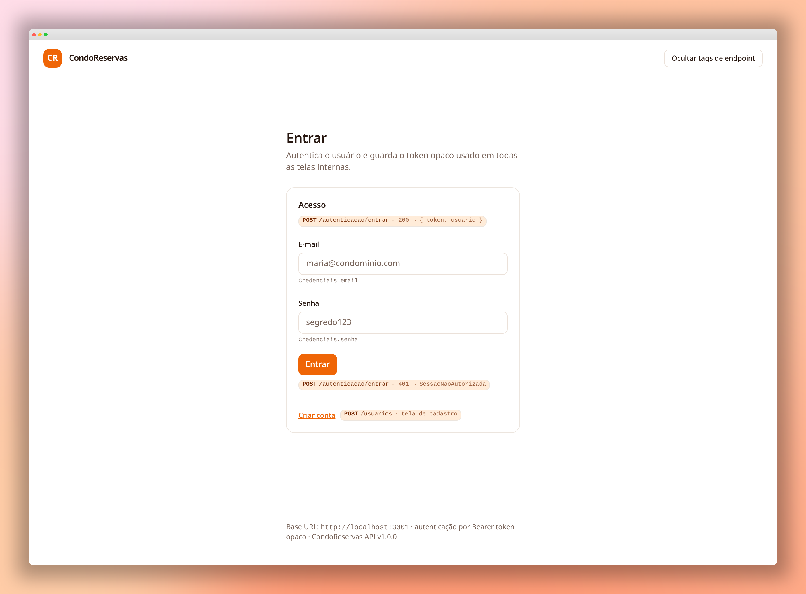
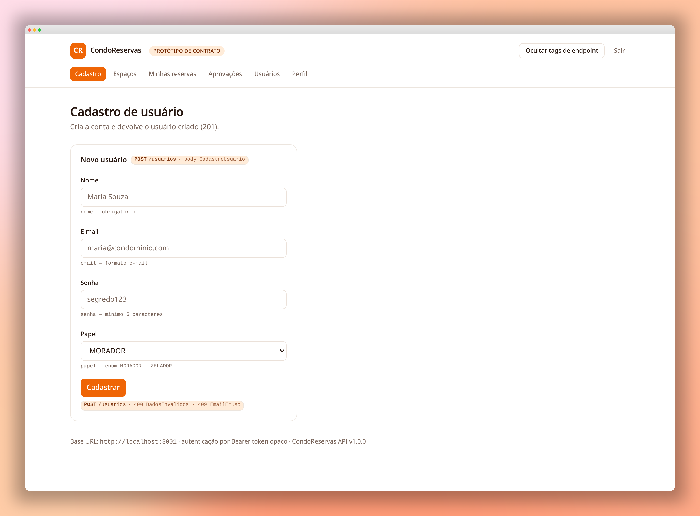
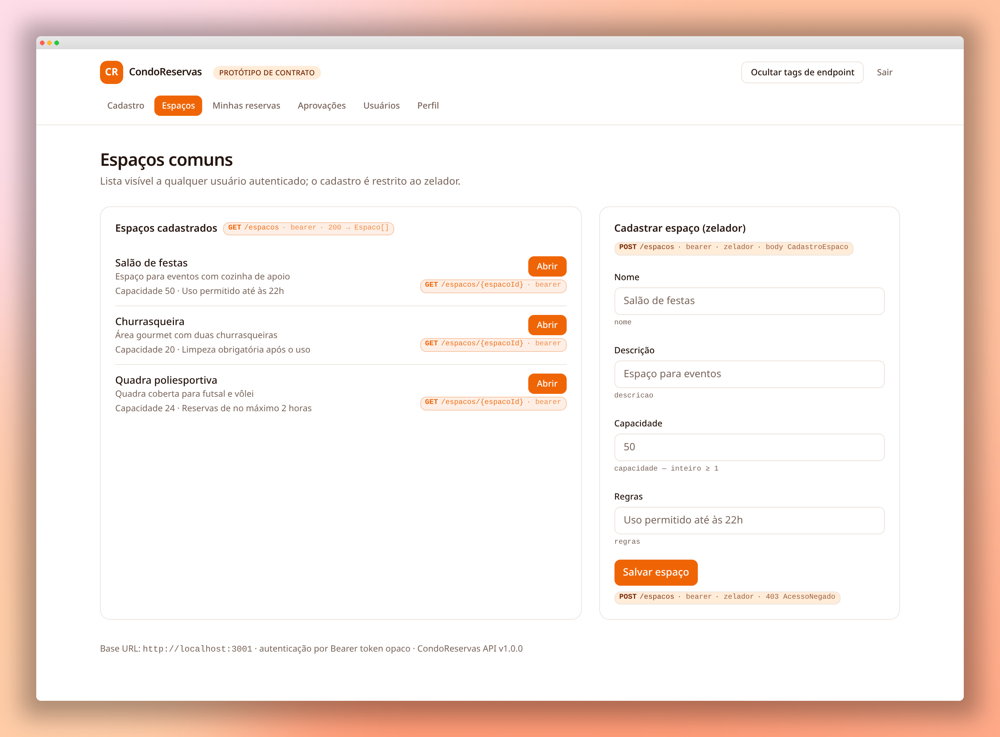
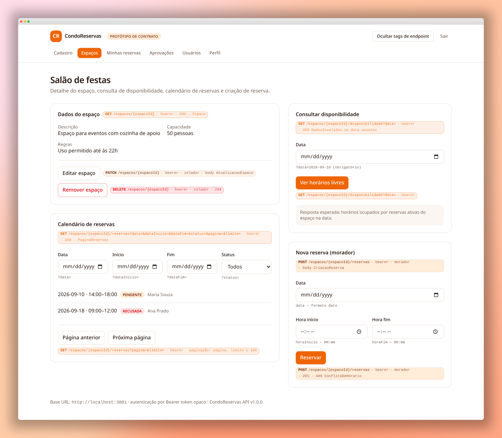
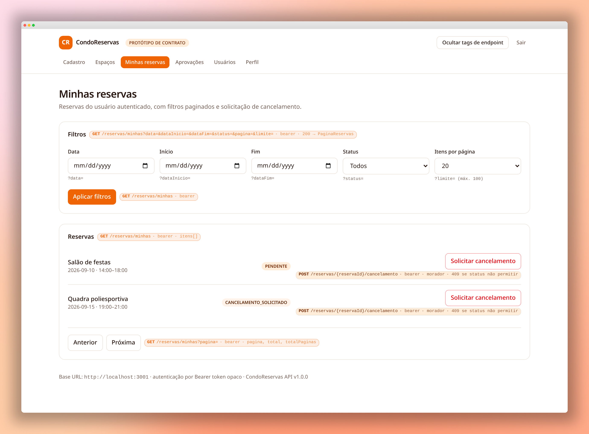
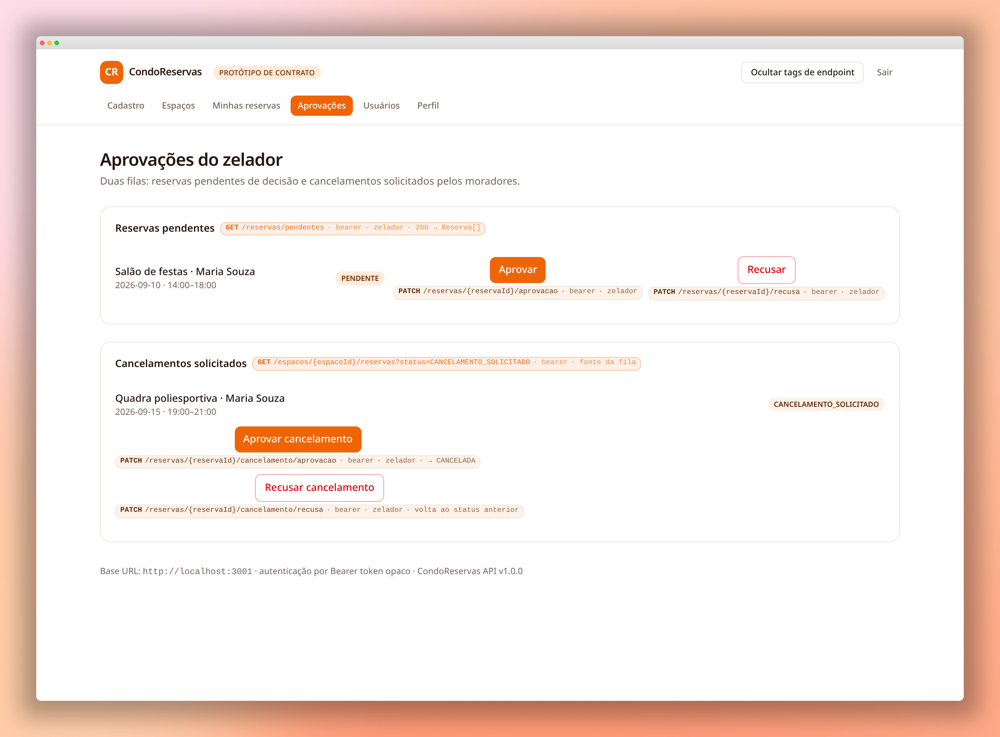
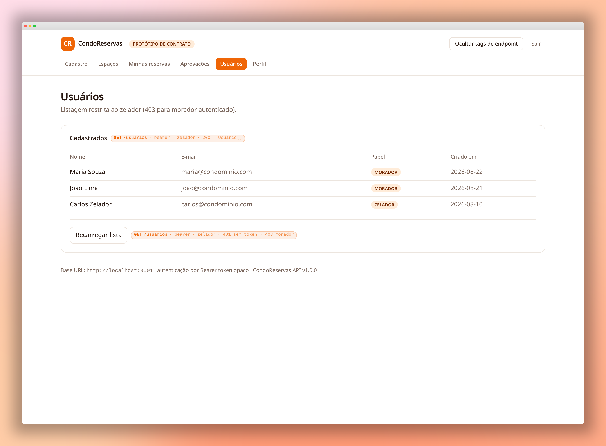
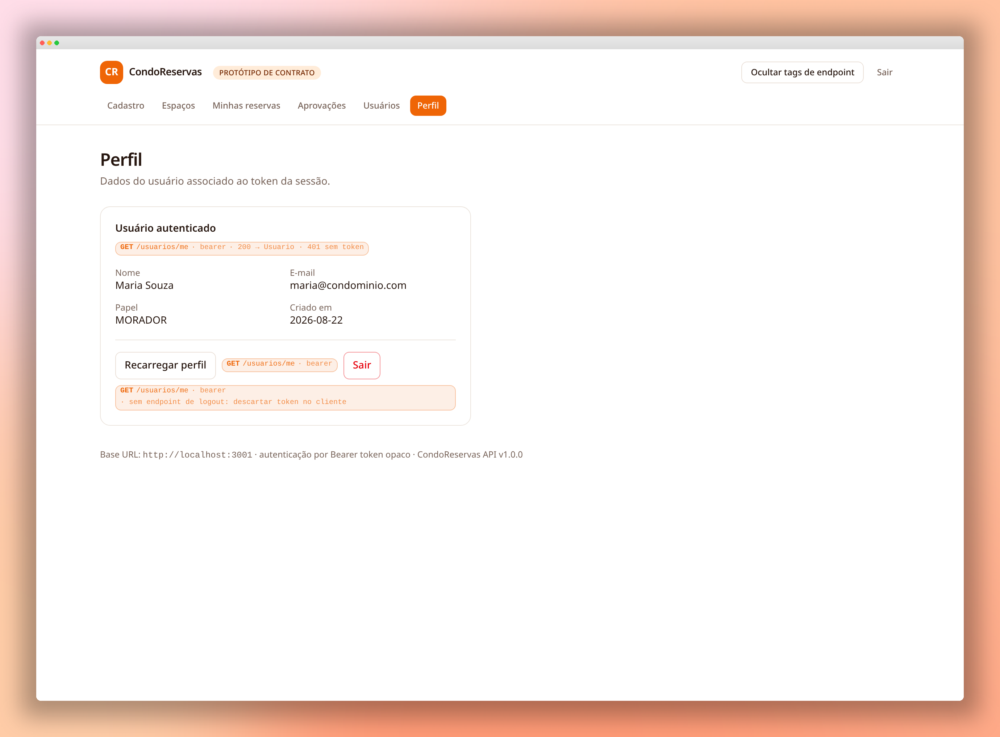

# Wireframes CondoReservas

**Documentacao visual da experiencia de reservas de areas comuns**

 

[Visao geral](#visao-geral) · [Fluxo](#fluxo-principal) · [Telas](#telas) · [Diretrizes](#diretrizes-de-layout)

---

## Visao geral

O CondoReservas organiza o ciclo completo de uso dos espacos compartilhados do condominio: o morador cria uma conta, consulta a disponibilidade, solicita reservas e acompanha seus pedidos. O zelador administra espacos, usuarios e decisoes pendentes.

Este documento apresenta o prototipo em ordem de navegacao, da tela **1** a **8**.

| Perfil | Responsabilidades principais |
| --- | --- |
| **Morador** | Consultar espacos, criar reservas, acompanhar status e solicitar cancelamentos |
| **Zelador** | Cadastrar espacos, consultar reservas, aprovar ou recusar pedidos e gerenciar usuarios |

## Fluxo principal

> As telas internas compartilham o mesmo cabecalho: marca, identificacao do prototipo, navegacao principal, controle de tags de endpoint e acao de saida.

## Telas

### 1. Entrar

Primeiro ponto de contato da aplicacao. Centraliza a autenticacao com e-mail e senha e oferece o caminho alternativo para criar uma conta.

**Elementos-chave**

- Cabecalho simplificado, sem navegacao interna.
- Formulario de acesso em cartao centralizado.
- Feedback de sucesso e falha associado a chamada de autenticacao.
- Link **Criar conta** direcionando para o cadastro.

---

### 2. Cadastro

Tela de criacao de usuario. Apresenta os campos essenciais e explicita que o papel pode ser **MORADOR** ou **ZELADOR**.

**Elementos-chave**

- Formulario vertical com nome, e-mail, senha e papel.
- Indicacoes de obrigatoriedade e regras de formato junto aos campos.
- Acao primaria **Cadastrar** destacada em laranja.
- Area livre a direita, mantendo o foco visual no formulario.

---

### 3. Espacos comuns

Catalogo de areas disponiveis para qualquer usuario autenticado. O layout divide a consulta dos espacos e a criacao restrita ao zelador.

**Elementos-chave**

- Lista ampla de espacos com nome, descricao, capacidade e regras.
- Acao **Abrir** em cada item para acessar os detalhes.
- Painel lateral de cadastro de espaco, visivel para o zelador.
- Separacao clara entre leitura e gerenciamento.

---

### 4. Detalhe do espaco

Visao operacional de um espaco especifico. Reune informacoes, disponibilidade, calendario de reservas e formulario para uma nova solicitacao.

**Elementos-chave**

- Bloco de dados do espaco com capacidade e regras de uso.
- Acoes de edicao e remocao disponiveis ao zelador.
- Consulta de disponibilidade por data.
- Calendario filtravel com paginacao.
- Formulario de nova reserva com data, hora inicial e hora final.

---

### 5. Minhas reservas

Area do morador para acompanhar suas reservas e filtrar resultados por periodo, status e quantidade de itens.

**Elementos-chave**

- Barra de filtros em uma faixa horizontal.
- Lista de reservas com espaco, data, horario e status.
- Acao de cancelamento com tratamento visual de risco.
- Paginacao para listas maiores.

---

### 6. Aprovacoes do zelador

Central de decisao do zelador. Separa reservas novas de solicitacoes de cancelamento para reduzir ambiguidades no fluxo administrativo.

**Elementos-chave**

- Secao **Reservas pendentes** com acoes **Aprovar** e **Recusar**.
- Secao **Cancelamentos solicitados** com acoes especificas para cada pedido.
- Status em etiquetas para leitura rapida.
- Acoes destrutivas representadas por contorno vermelho.

---

### 7. Usuarios

Lista administrativa de usuarios cadastrados, acessivel somente ao zelador. O foco e a comparacao rapida de dados em formato tabular.

**Elementos-chave**

- Tabela com nome, e-mail, papel e data de criacao.
- Etiquetas distinguem **MORADOR** e **ZELADOR**.
- Botao **Recarregar lista** para atualizar os dados.
- Mensagem de acesso negado prevista para moradores autenticados.

---

### 8. Perfil

Resumo da identidade do usuario autenticado e da sessao atual. Tambem concentra a acao de saida.

**Elementos-chave**

- Cartao de leitura com nome, e-mail, papel e data de criacao.
- Acao **Recarregar perfil** para atualizar os dados.
- Acao **Sair** com destaque de risco.
- Mensagem explicita de que o logout descarta o token no cliente.

## Diretrizes de layout

### Hierarquia visual

- Titulos de pagina grandes e alinhados ao conteudo principal.
- Subtitulos explicam o objetivo da tela em uma frase curta.
- Cartoes agrupam tarefas relacionadas sem competir com o conteudo.
- Tags monoespacadas representam endpoints, status e contratos da API.

### Cores e estados

| Uso | Tratamento visual |
| --- | --- |
| Acao primaria | Laranja solido com texto claro |
| Acao secundaria | Fundo claro e contorno neutro |
| Acao destrutiva | Contorno e texto vermelho |
| Status informativo | Etiqueta em tons claros de laranja |
| Endpoint | Tipografia monoespacada e fundo quente suave |

### Comportamento responsivo

Em larguras menores, os paineis lado a lado devem se empilhar verticalmente, os filtros devem quebrar em novas linhas e a tabela de usuarios deve permitir rolagem horizontal. A ordem e a prioridade das acoes devem permanecer iguais as apresentadas nos wireframes.

## Assets

Todas as imagens desta documentacao estao em [`docs/assets`](../assets/). Os nomes seguem a ordem da navegacao para facilitar atualizacoes e revisoes.
